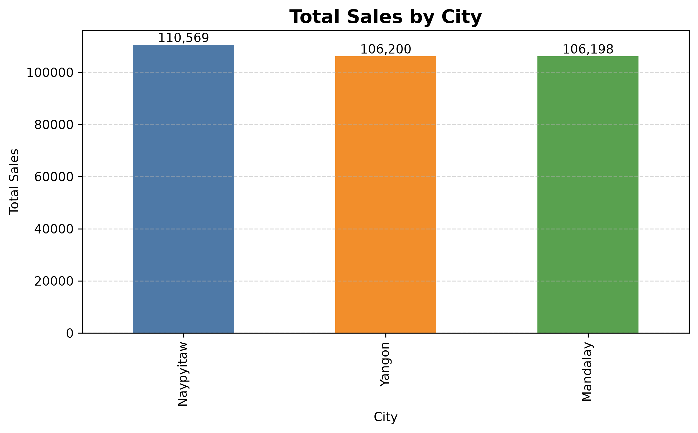
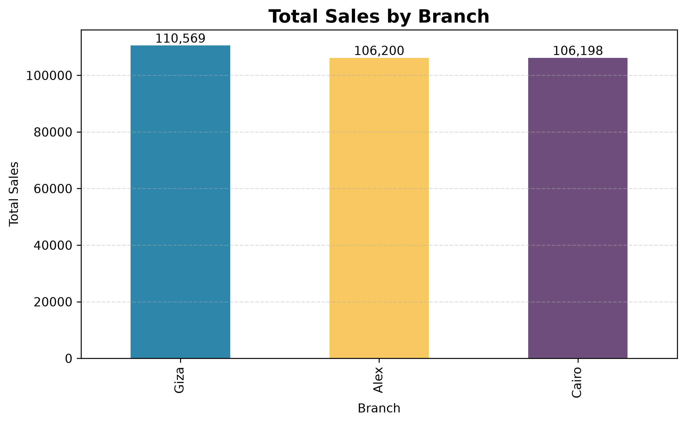
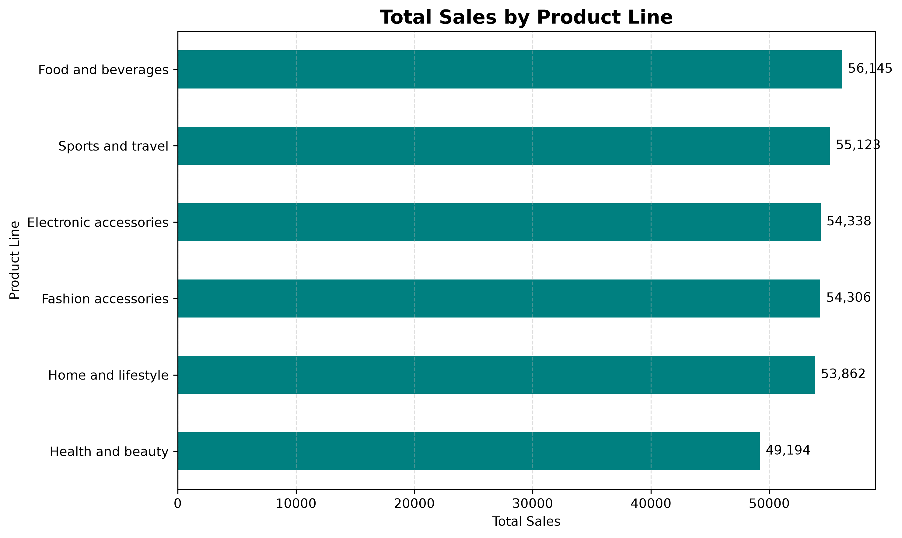
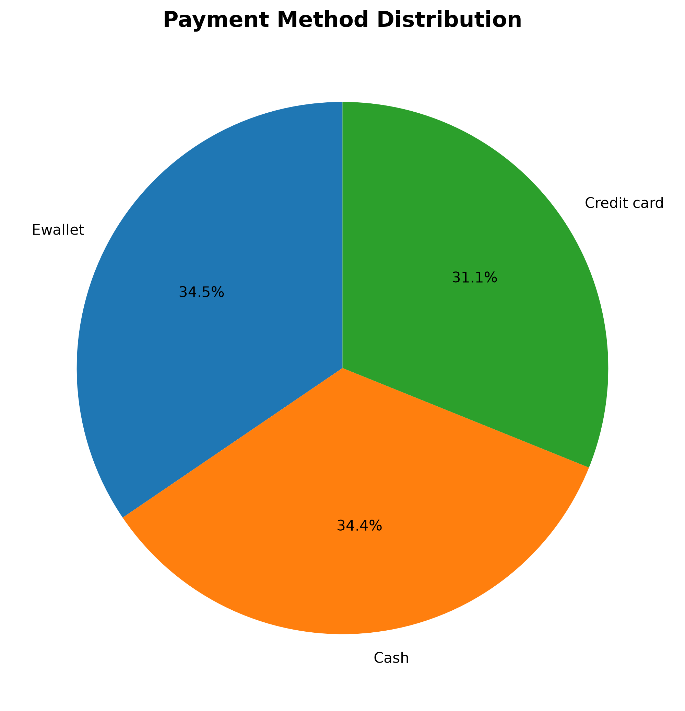
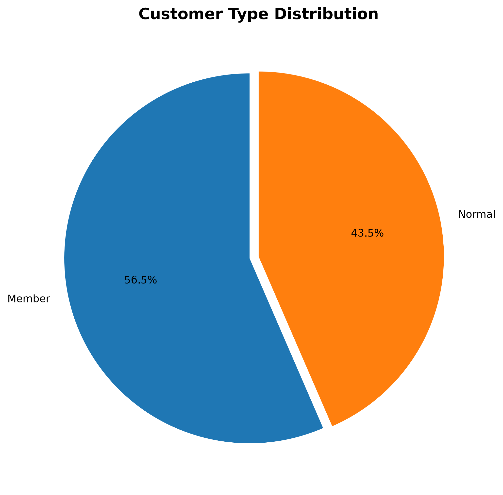
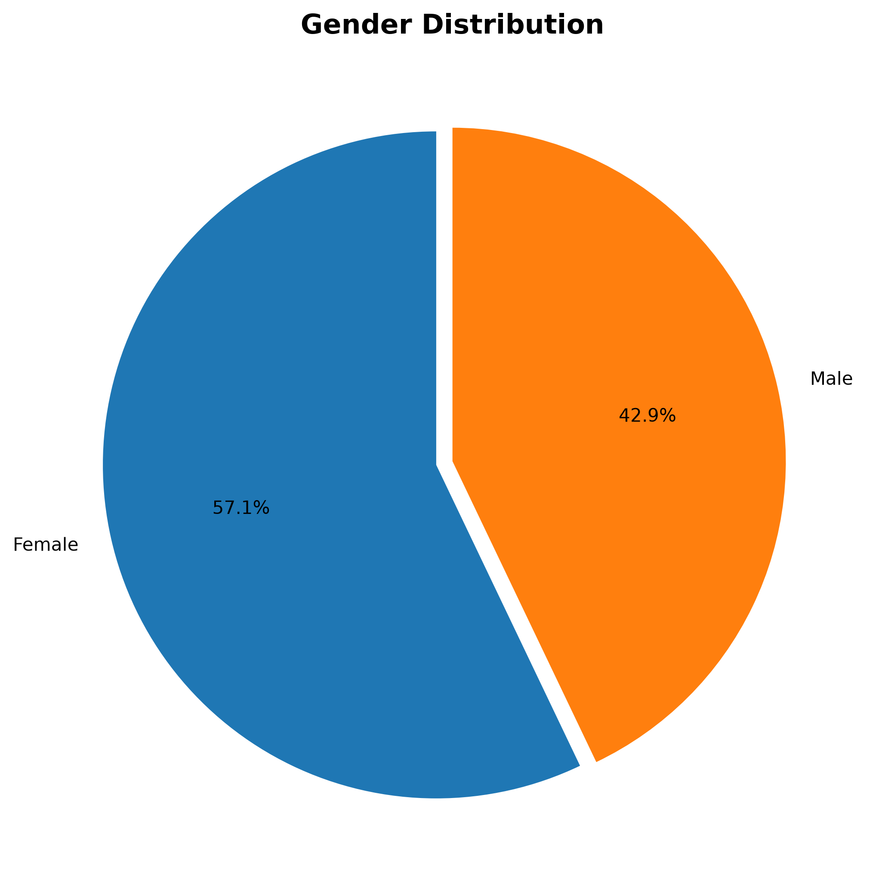
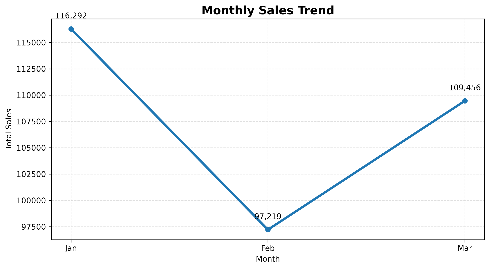
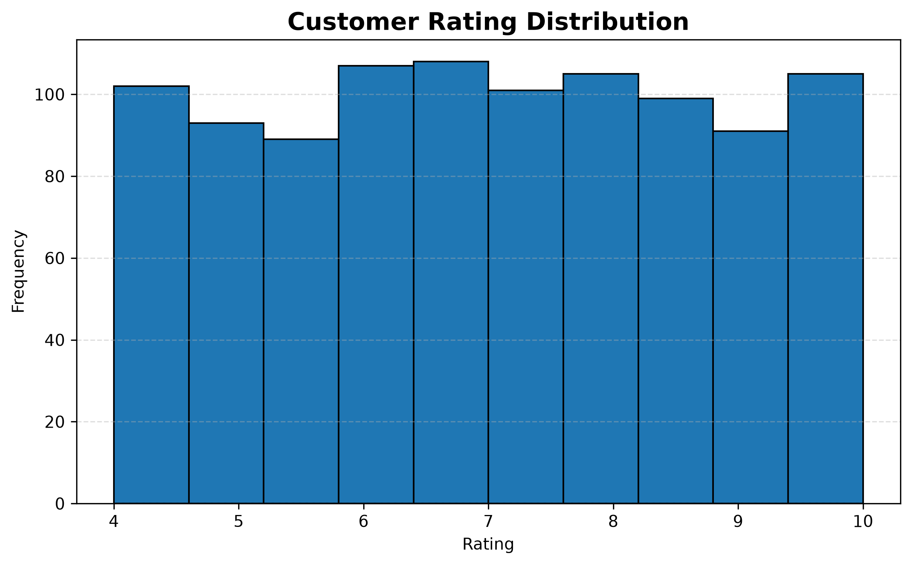
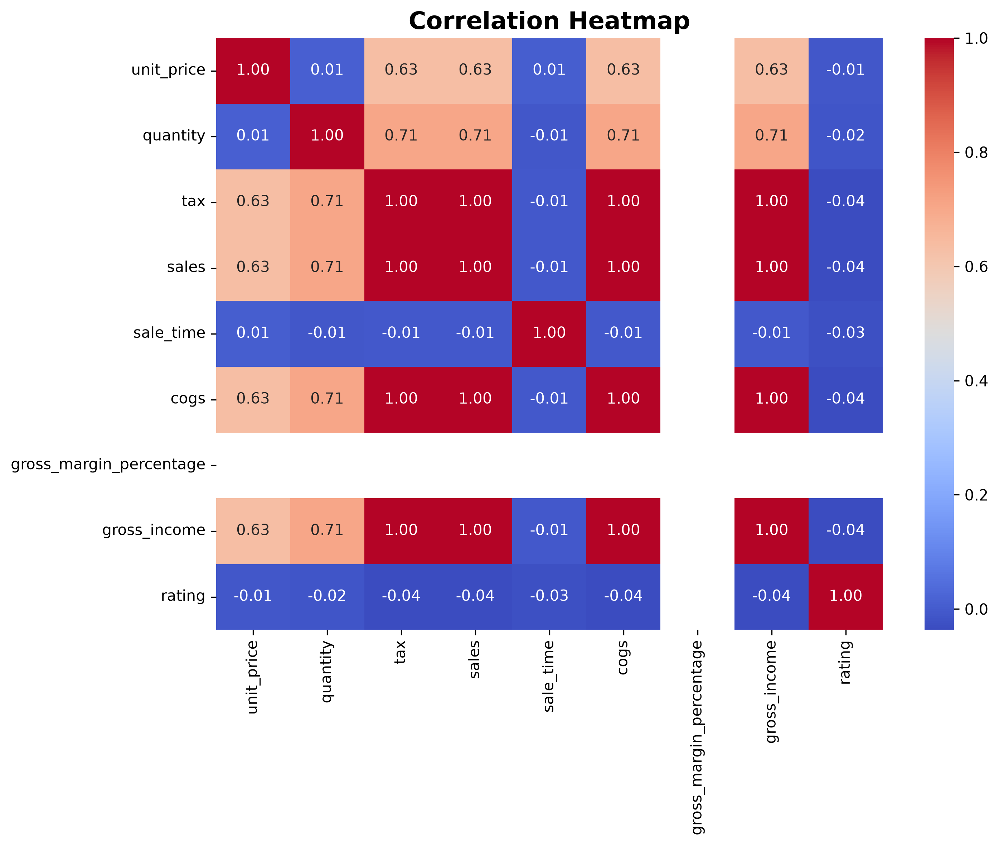
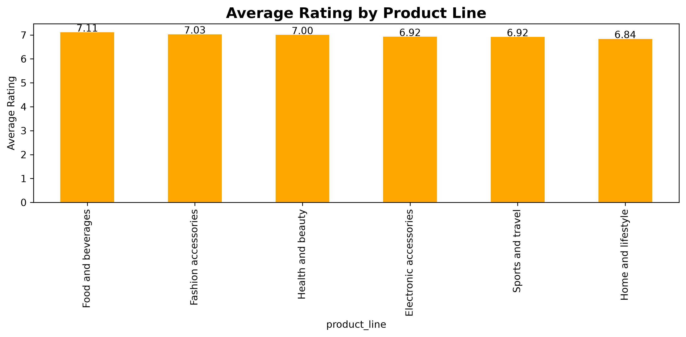

# 🛒 Supermarket Sales Analysis

<p align="center">


</p>

---

# 📖 Overview

This project performs an **end-to-end supermarket sales analysis** using **Python**, **MySQL**, **Pandas**, **Matplotlib**, and **Seaborn**.

The dataset is imported into MySQL, queried using SQL, processed with Pandas, and visualized through multiple charts to identify sales trends, customer behavior, product performance, and business insights.

---

# 🎯 Objectives

- Import CSV data into MySQL
- Perform SQL Queries
- Analyze customer purchasing behaviour
- Visualize sales trends
- Generate business insights
- Practice Python Data Analysis workflow

---

# 🛠️ Technologies Used

| Technology | Purpose |
|------------|---------|
| Python | Programming |
| MySQL | Database |
| SQL | Data Querying |
| Pandas | Data Analysis |
| Matplotlib | Data Visualization |
| Seaborn | Statistical Visualization |
| Git | Version Control |
| GitHub | Project Hosting |

---

# 📂 Project Structure

```text
Supermarket-Sales-Analysis/
│
├── charts/
│   ├── average_rating_by_product_line.png
│   ├── correlation_heatmap.png
│   ├── customer_type_distribution.png
│   ├── gender_distribution.png
│   ├── monthly_sales_trend.png
│   ├── payment_method_distribution.png
│   ├── product_line_sales.png
│   ├── rating_distribution.png
│   ├── sales_by_branch.png
│   └── sales_by_city.png
│
├── data/
│   └── supermarket_sales.csv
│
├── analysis.py
├── import_data.py
├── requirements.txt
├── queries.sql
├── README.md
└── .gitignore
```

---

# 📊 Dataset Information

| Item | Value |
|------|-------|
| Records | 1000 |
| Original Columns | 17 |
| Working DataFrame Columns | 18 |
| Database | MySQL |

---

# 📈 Visualizations

## 🏙 Sales by City



---

## 🏢 Sales by Branch



---

## 🛍 Sales by Product Line



---

## 💳 Payment Method Distribution



---

## 👥 Customer Type Distribution



---

## 🚻 Gender Distribution



---

## 📅 Monthly Sales Trend



---

## ⭐ Rating Distribution



---

## 🔥 Correlation Heatmap



---

## 🌟 Average Rating by Product Line



---

# 📌 Project Highlights

- Imported CSV dataset into MySQL.
- Connected Python with MySQL.
- Performed SQL-based analysis.
- Used Pandas for data processing.
- Created multiple business visualizations.
- Identified sales trends and customer behaviour.
- Built a complete end-to-end data analysis project.

---

# 💡 Key Business Insights

- Naypyitaw generated the highest sales.
- Food & Beverages was the best-selling product category.
- Customer ratings remained consistently high.
- Sales were balanced across all branches.
- Payment methods were evenly distributed.
- Member and Normal customers showed similar purchasing behaviour.
- Quantity purchased positively influenced total sales.

---

# 🚀 Getting Started

## Clone Repository

```bash
git clone https://github.com/chandan0379/supermarket-sales-analysis.git
```

## Install Dependencies

```bash
pip install -r requirements.txt
```

## Import Dataset into MySQL

```bash
python import_data.py
```

## Run Analysis

```bash
python analysis.py
```

---

# 📌 Future Improvements

- Interactive Streamlit Dashboard
- Customer Segmentation
- Sales Forecasting
- KPI Dashboard
- Export Reports to Excel/PDF

---

# 👨‍💻 Author

**Chandan Kundu **

GitHub: https://github.com/chandan0379

---

## ⭐ If you found this project useful, consider giving it a Star!